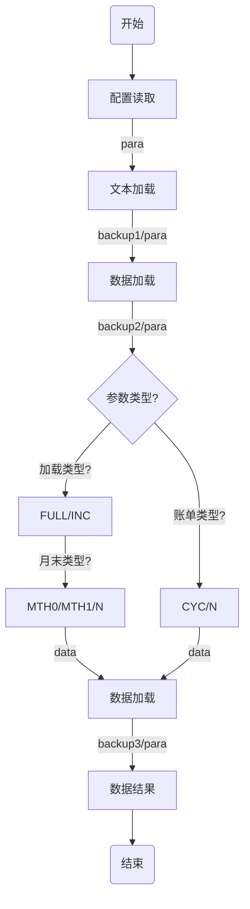

# PyTools
_Cute Tools BY Python_

001.Test_CleanBigFile, 大文件扫描

002.Test_Proxy, 端口映射之代理服务器

003.Test_Telnet, 循环telnet

004.Test_Json, Json解析

005.Test_SocketServer, Socket5代理服务器[爬虫]

006.Test_pandas_func, pandas列函数

007.Test_count_XXX_in_string, 用于计算给定字符串中是否有连续出现n次的字符

008.Test_pandas_query, pandas-query筛选

009.Test_multiprocessing_run, multiprocessing多线程

010.Test_pymysql_pools, mysql数据库连接池 by pymysql

011.Test_requests&requests_futures, requests连接优化及堵塞问题

012.Test_py_memory, python代码内存检查

013.Test_DecisionTreeClassifier_var, py决策树 

`TODO: bugs, no order by the numbers!!!`

014.Test_CardBinCheck, 支付宝卡号验证工具

_END_

#### 数据仓库2.0
##### 1.0版本回顾

* 基本流程



* 存在问题：
1. 没法同时跑批，浪费服务器资源；
2. 备份过度，空间消耗过大，备份机制不佳；
3. 修数比较慢；
4. CYC定义代码写死；
5. 新添加数据源不方便，人工参与太多；
6. 报错机制缺失，尤其是隔天查看不方便；
7. 文本配置模式，配置效果不佳；
8. 部分数据源缺失时，考虑备份和数据加载，数据修复停止；

>作业脱离

```math
e^x=\lim_{n\to\infty} \left( 1+\frac{x}{n} \right)^n
\qquad (1)
```

